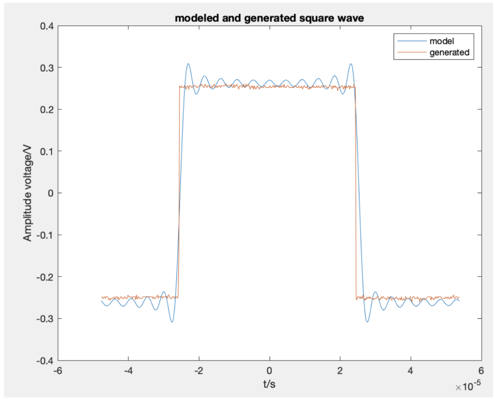
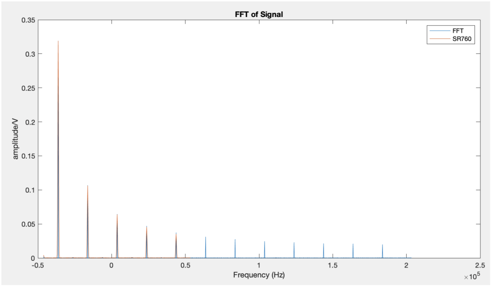
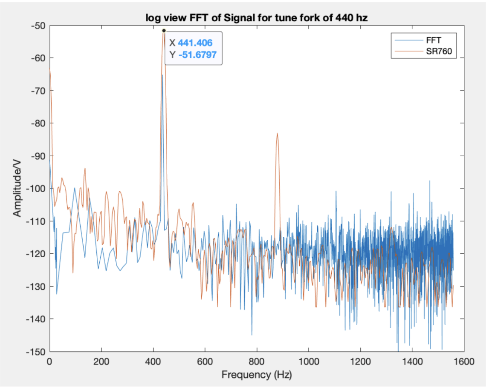

# Hardware FFT Validation & Signal Spectrum Analysis in MATLAB

MATLAB analysis of electrical and acoustic signals measured with an oscilloscope and a Stanford Research Systems SR760 FFT Spectrum Analyzer. The project reconstructs ideal waveforms with Fourier series, computes normalized single-sided FFT spectra from time-domain measurements, and compares the software results with dedicated spectrum-analysis hardware.

## Engineering relevance

This project demonstrates a measurement-and-validation workflow relevant to **hardware test, validation, instrumentation, and signal-analysis roles**:

- Collected repeated time-domain measurements using a function generator, oscilloscope, microphone, and tuning forks.
- Imported oscilloscope CSV files and SR760 spectrum exports into MATLAB.
- Converted sampled waveforms from the time domain to the frequency domain using the FFT.
- Normalized single-sided spectra and aligned frequency axes for instrument-to-software comparison.
- Compared MATLAB-computed spectra with measurements from dedicated FFT hardware.
- Identified harmonic content, broadband components, noise, and non-ideal waveform behavior.
- Documented discrepancies between instruments rather than assuming ideal agreement.

## Test equipment

| Equipment | Role in the experiment |
| --- | --- |
| Stanford Research Systems SR760 FFT Spectrum Analyzer | Hardware frequency-spectrum measurement |
| Tektronix oscilloscope | Time-domain waveform acquisition and CSV export |
| Function generator | Square- and triangular-wave excitation |
| Microphone | Acoustic signal acquisition |
| 440 Hz, 293.67 Hz, and 493.88 Hz tuning forks | Known-frequency acoustic references |
| MATLAB | Fourier synthesis, FFT computation, normalization, comparison, and plotting |

SR760 measurements were exported from the laboratory acquisition workflow through GPIB/LabVIEW and compared with FFTs calculated from oscilloscope samples.

## Measurement and analysis workflow

```text
Signal source
    -> oscilloscope time-series acquisition
    -> CSV import into MATLAB
    -> single-sided FFT and amplitude normalization
    -> frequency-axis alignment
    -> comparison with SR760 spectrum data
```

Each generated waveform, tuning fork, and voice condition was measured in three repeated oscilloscope acquisitions. The script preserves the repeated measurements and selects a consistent trial for spectrum comparison.

## Analysis performed

### 1. Fourier-series waveform synthesis

- Reconstructs square waves with odd Fourier harmonics.
- Reconstructs triangular waves with the expected \(1/n^2\) harmonic rolloff.
- Reconstructs a sawtooth wave and compares partial sums with MATLAB's ideal waveform.
- Extends the measured-waveform comparison through the 21st harmonic.
- Visualizes the effect of harmonic count and the Gibbs phenomenon near discontinuities.

### 2. Generated electrical signals

- Imports three oscilloscope recordings for square and triangular waves.
- Extracts a one-period analysis window and centers the waveform in time.
- Overlays modeled and measured waveforms over a common one-period window.
- Computes normalized single-sided FFT spectra from the oscilloscope data.
- Compares MATLAB FFT peaks with SR760 hardware measurements.



*A 21st-order Fourier-series reconstruction compared with the function-generator square wave measured by the oscilloscope.*



*Single-sided FFT calculated from oscilloscope samples compared with the SR760 hardware spectrum for the generated square wave.*
### 3. Tuning-fork spectrum validation

- Analyzes nominal frequencies of 440 Hz, 293.67 Hz, and 493.88 Hz.
- Compares FFT spectra derived from oscilloscope recordings with SR760 measurements.
- Evaluates spectra in both linear-amplitude and logarithmic/dB views.
- Uses known tuning-fork frequencies as references for peak-location validation.

### 4. Human-voice spectrum analysis

- Compares two sung tones with one spoken recording.
- Identifies regularly spaced harmonic peaks in sustained tones.
- Contrasts harmonic spectra with the broader distribution of spoken sound.
- Examines the effect of background noise and instrument processing on weak spectral components.

## Representative results

- A 21st-harmonic Fourier model reproduced the measured square-wave shape, including the expected ringing near discontinuities.
- Dominant harmonic locations in MATLAB-computed spectra aligned closely with the SR760 measurements for generated square and triangular waves.
- The nominal 440 Hz tuning fork produced a measured dominant peak at approximately **441.4 Hz**, corresponding to about **0.32% frequency error**.
- Tuning-fork spectra showed concentrated dominant peaks, while human-voice recordings contained additional harmonic and broadband components.
- Sung tones exhibited more regular harmonic spacing than spoken voice.
- Unexpected peaks and amplitude differences were treated as possible effects of waveform non-idealities, background noise, frequency-bin alignment, and instrument processing.



*MATLAB and SR760 spectra for the nominal 440 Hz tuning fork. The measured dominant peak occurs at approximately 441.4 Hz.*

## Technical implementation

| Task | MATLAB implementation |
| --- | --- |
| Data import | `readtable`, `load` |
| Sampling-rate estimation | `Fs = 1 / mean(diff(t))` |
| Spectrum calculation | `fft` |
| Single-sided normalization | `2 * abs(FFT) / N` |
| Logarithmic amplitude | `mag2db` |
| Fourier synthesis | Complex exponentials and trigonometric partial sums |
| Validation | Overlay plots of MATLAB results and SR760 exports |

## Repository contents

| File | Description |
| --- | --- |
| `Fourier_Analysis.m` | Complete MATLAB workflow for Fourier synthesis, electrical-waveform FFT validation, tuning-fork analysis, and voice-spectrum comparison |
| `D*/` | Expected oscilloscope CSV folders for square- and triangular-wave measurements |
| `E*/` | Expected oscilloscope CSV folders for tuning-fork measurements |
| `F*/` | Expected oscilloscope CSV folders for voice measurements |
| `partD*.txt` | SR760 exports for generated electrical waveforms |
| `partE*.txt` | SR760 exports for tuning-fork spectra |
| `partF*.txt` | SR760 exports for voice spectra |

> The original oscilloscope CSV files and SR760 text exports are not included in this repository. The script documents the expected data structure but requires the original measurement files to reproduce every figure.

## Running the analysis

### Requirements

- MATLAB
- Signal Processing Toolbox (`sawtooth`, `mag2db`)
- Original oscilloscope and SR760 data files arranged in the expected directory structure

### Run

1. Place `Fourier_Analysis.m` in the parent directory of the `D*`, `E*`, and `F*` measurement folders.
2. Place the corresponding `partD*`, `partE*`, and `partF*` SR760 exports in the same parent directory.
3. Open that directory in MATLAB.
4. Run:

```matlab
Fourier_Analysis
```

The script loads the measurement sets sequentially and generates the waveform-reconstruction and spectrum-comparison figures.

## Limitations and test improvements

- Some comparisons require manual frequency-axis alignment because the oscilloscope FFT bins and SR760 export use different frequency references.
- The logarithmic comparison includes amplitude and frequency remapping; it should be interpreted as a qualitative comparison rather than a calibrated transfer-function measurement.
- Environmental acoustic noise and non-ideal function-generator output can introduce components absent from ideal Fourier models.
- A future version could automate peak detection, report frequency and amplitude error for every trial, and calculate repeatability statistics across all three acquisitions.

## Scope

This was a Rutgers University Physics 326 laboratory project. The repository demonstrates experimental signal acquisition, MATLAB spectrum analysis, and cross-instrument validation; it does not claim design of the oscilloscope, SR760 analyzer, or acquisition hardware.

## Tools and skills demonstrated

`MATLAB` · `FFT` · `Fourier series` · `spectrum analysis` · `oscilloscope data` · `GPIB/LabVIEW acquisition` · `hardware validation` · `signal normalization` · `frequency-domain analysis` · `technical documentation`

Adobe Acrobat


Summarize this


Ask AI Assistant
